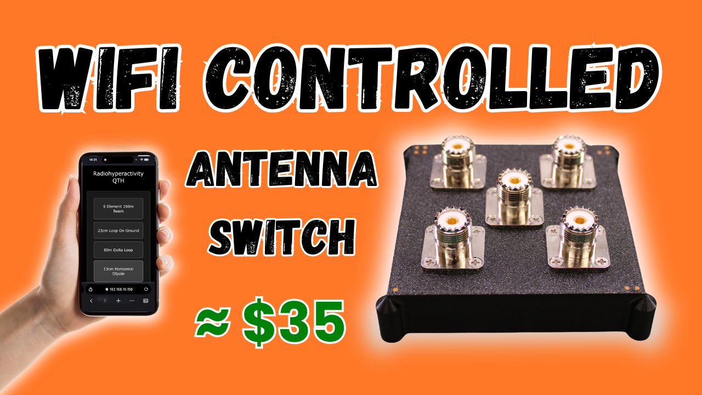

# ESP32 Antenna Switcher

A web-based antenna switcher controller for ESP32.

[Build video](https://youtu.be/3fS-DUADLck)

[](https://youtu.be/3fS-DUADLck)

## Bill of Materials

- **4:1 coax remote antenna switch**:
  - Affiliate link: https://s.click.aliexpress.com/e/_c4lKVSC3
  - Non-affiliate link: https://www.aliexpress.com/item/1005004278590056.html
- **Alternate 4:1 coax remote antenna switch, 500W and matal enclosure**
  - Affiliate link: https://s.click.aliexpress.com/e/_c4Uy7YfD
  - Non-affiliate link: https://www.aliexpress.com/item/1005008447011701.html
- **ESP32-WROOM-32U DevKit**:
  - Affiliate link: https://s.click.aliexpress.com/e/_c374wDdv
  - Non-affiliate link: https://www.aliexpress.com/item/1005010136688086.html
- **5mm LED Metal Bezel**:
  - Affiliate link: https://s.click.aliexpress.com/e/_c3t1lnEj
  - Non-affiliate link: https://www.aliexpress.com/item/32952325509.html
- **Buck Converter**:
  - Affiliate link: https://s.click.aliexpress.com/e/_c3icTadz
  - Non-affiliate link: https://www.aliexpress.com/item/1005008257960729.html
- **Aviation Connectors**:
  - Affiliate link: https://s.click.aliexpress.com/e/_c32DhEPh
  - Non-affiliate link: https://www.aliexpress.com/item/1005008859055554.html
- **Heat Set Threaded Inserts**:
  - Affiliate link: https://s.click.aliexpress.com/e/_c447MWZl
  - Non-affiliate link: https://www.aliexpress.com/item/1005007342105110.html
- **PCB Prototype Board**:
  - Affiliate link: https://s.click.aliexpress.com/e/_c4DUlcxp
  - Non-affiliate link: https://www.aliexpress.com/item/1005009630089216.html

## "Schematic"

Sorry about the quality of the "schematic", I built this from a mental schematic, so this was created after the fact.


## 3D Printed Parts

### Antenna Switch Case


- [antenna-switch-case.fcstd](<antenna-switch-case.fcstd>)
- [antenna-switch-case.stl](<antenna-switch-case.stl>)

### Antenna Switch Lid


- [antenna-switch-lid.fcstd](<antenna-switch-lid.fcstd>)
- [antenna-switch-lid.stl](<antenna-switch-lid.stl>)

### Control Box and Lid


- [control-box-and-lid.fcstd](<control-box-and-lid.fcstd>)
- [control-box.stl](<control-box.stl>)
- [control-box-lid.stl](<control-box-lid.stl>)

## Features

- **Web Interface**: Modern, responsive web UI for antenna selection
- **4 Antenna Outputs**: Control 4 GPIO pins (only one active at a time)
- **WiFi Configuration**: Web-based configuration portal in AP mode
- **Serial Control**: Configure and control via USB serial interface
- **HTTP API**: RESTful API for programmatic control
- **Auto-reconnect**: Automatic WiFi reconnection with configurable retry intervals

## Hardware Requirements

- ESP32-WROOM-32U WROVER Module (38-pin)
- USB connection for serial communication and programming

## GPIO Configuration

The following GPIO pins are used (easily configurable in code via #defines):

**Antenna Outputs:**
- **GPIO 16**: Antenna 1 output
- **GPIO 17**: Antenna 2 output
- **GPIO 18**: Antenna 3 output
- **GPIO 19**: Antenna 4 output

To change GPIO pins, modify the defines at the top of `src/main.cpp`:

```cpp
// Antenna outputs
#define ANT1_PIN 16
#define ANT2_PIN 17
#define ANT3_PIN 18
#define ANT4_PIN 19
```

## Installation

1. Open the project folder in Visual Studio Code
2. Install the PlatformIO extension if not already installed
3. Open PlatformIO and build the project
4. Upload to your ESP32

## Initial Setup

### First Boot (AP Mode)

On first boot or when no WiFi credentials are configured:

1. The device creates an open WiFi network: `ESP32-AntennaSwitch-<ChipID>`
2. Connect to this network with your phone or computer
3. Navigate to `192.168.4.1` in your web browser
4. Enter your WiFi credentials and unit name in the configuration form
5. Click "Save & Restart"
6. The device will restart and connect to your WiFi network

### Serial Configuration

You can also configure the device via the serial interface:

1. Connect via USB (115200 baud)
2. Use the serial commands (see below)

## Serial Commands

Connect at **115200 baud** and use the following commands:

```
set ssid <WiFi SSID>          - Set WiFi network name
set password <WiFi Password>  - Set WiFi password
set name <Unit Name>          - Set a friendly name for the unit
get status                    - Display current configuration and status
```

**Examples:**
```
set ssid MyNetwork
set password MyPassword123
set name Antenna_Switch_1
get status
```

**Note**: Changing WiFi SSID or password will cause the device to restart automatically.

## Web Interface

Once connected to WiFi, access the web interface at:
- `http://<IP_ADDRESS>` (IP shown in serial monitor)

The web interface provides:
- 4 antenna selection buttons (Ant 1-4)
- Visual indication of active antenna
- Configuration form for WiFi and unit and antenna names

## HTTP API

### Activate Antenna

**Endpoint**: `PUT /activate/<ID>`

Where `<ID>` is 1, 2, 3, or 4

### Deactivate Antennas

**Endpoint**: `PUT /activate/0`

**Response**: 
- `200 OK` - Antenna activated successfully (or already active)
- `500 Internal Server Error` - Error occurred

**Example**:
```bash
curl -X PUT http://192.168.1.100/activate/2
```

### Get Status

**Endpoint**: `GET /status`

**Response**: JSON object with current status

**Example Response**:
```json
{
  "activeAntenna": 2,
  "unitName": "Antenna_Switch_1",
  "wifiSSID": "MyNetwork",
  "wifiStatus": "Connected",
  "ipAddress": "192.168.1.100"
}
```

## WiFi Connection Behavior

- **Initial Connection**: Attempts to connect for 60 seconds
- **Failed Connection**: Reverts to AP mode if connection fails
- **Retry Interval**: Retries connection every 120 seconds while in AP mode
- **Connection Loss**: Automatically reconnects if WiFi connection is lost

## Default Behavior

- At boot, all antenna outputs are set to LOW (inactive)
- Active antenna selection is not persisted across reboots
- WiFi credentials and unit name ARE persisted in NVS

## Building and Uploading

### Via PlatformIO CLI:
```bash
pio run                 # Build
pio run --target upload # Upload to device
pio device monitor      # Open serial monitor
```

### Via VS Code:
- Use PlatformIO toolbar buttons
- Or press `Ctrl+Alt+U` to upload
- Press `Ctrl+Alt+S` to open serial monitor

## Troubleshooting

### Can't find the AP network
- Check that STATUS LED (on the ESP32 board) is blinking fast (200ms)
- Look for network named `ESP32-AntennaSwitch-<XXXXXX>`
- Try restarting the device

### Device won't connect to WiFi
- Verify credentials are correct using `set ...` commands
- Check WiFi network is 2.4GHz (ESP32 doesn't support 5GHz)
- Monitor serial output for connection details

### GPIO pins not working
- Verify pins are not used for boot strapping
- Check physical connections
- Review GPIO assignments in code
- Use multimeter to verify output voltage (HIGH = 3.3V, LOW = 0V)

## Technical Details

- **Platform**: ESP32 (espressif32)
- **Framework**: Arduino
- **Web Server**: ESP32 WebServer
- **Storage**: Preferences (NVS)
- **Baud Rate**: 115200

## Project Structure

```
antenna-switcher/
├── platformio.ini        # PlatformIO configuration
├── src/
│   └── main.cpp         # Main application code
└── README.md            # This file
```

## License

GNU GENERAL PUBLIC LICENSE, Version 3
